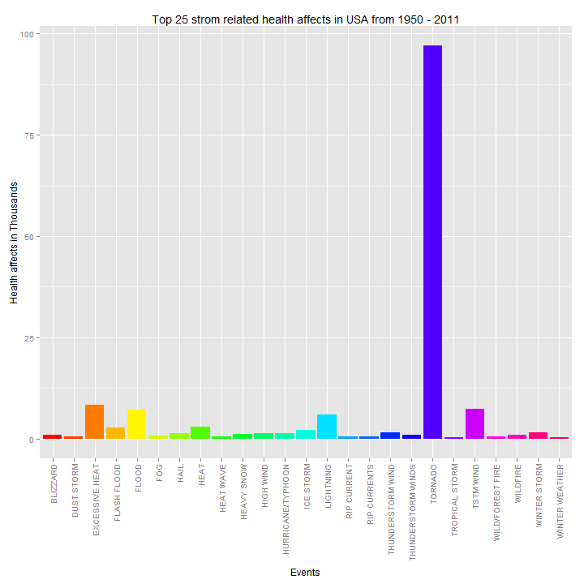
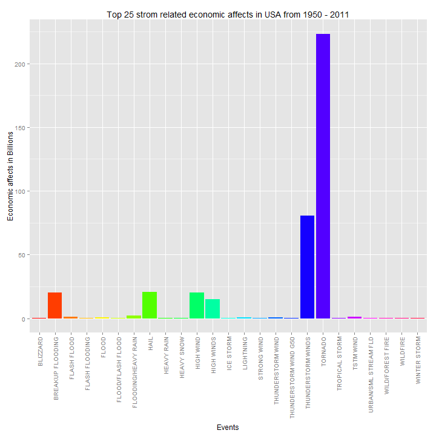
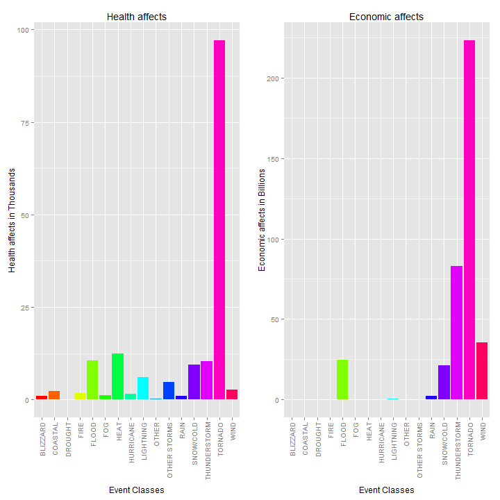

# Analysis of Storm Affects on Population Health and Economy in USA

## Synopsis
In this report we aim to describe the affects of storms in USA on population health and economy by analyzing storm data from 1950 to 2011. Using the storm data obtained from  U.S. National Oceanic and Atmospheric Administration's (NOAA) storm database, we present type of storm related events that are responsible for most negative affects. Top 25 such storm events are presented. Additionally individual events are grouped into event classes and affects of those are also presented.   


## Data Processing
### Analysis
We postulate that sum aggregates of damages will provide a meaninful measure for our analysis.  

Population health (HEALTHDAMAGES) for each event is obtained after cumulative sum of reported injuries and fatilities for each year between 1950 - 2011. Economic affect (DMGCASH) for each event is obtained after cumlative sum of crop and property damage and after applying appropiate multipler. The results are then sorted and top 25 events and their values are presented.  

Event Class affects is done similary except each storm data event is first grouped into a class and then the sums are obtained for each class. Please see MakeGroups() function (below) 

### Loading
The data used for this analysis is available at this URL https://d396qusza40orc.cloudfront.net/repdata%2Fdata%2FStormData.csv.bz2.  


```r
#repdata-data-StormData.csv.bz2 is obtained from https://d396qusza40orc.cloudfront.net/repdata%2Fdata%2FStormData.csv.bz2
storm.data <- read.csv("repdata-data-StormData.csv.bz2")
```

### Processing Health Affects
Subset the storm data to extract health affects

```r
library(ggplot2)
library(data.table)
library(xtable)
sd.health <- storm.data[ storm.data$FATALITIES > 0 | storm.data$INJURIES > 0, 
                         c("EVTYPE", "INJURIES", "FATALITIES")]
sd.health$EVTYPE2 <- as.factor(toupper(sd.health$EVTYPE))    
```

Calculate health affects (HEALTHDAMAGES)

```r
sd.health$HEALTHDAMAGES <- sd.health$FATALITIES + sd.health$INJURIES;
sd.health.sum <- tapply(sd.health$HEALTHDAMAGES, sd.health$EVTYPE2, sum)
sd.health.sum <- data.frame(EVTYPE2=names(sd.health.sum), 
                            HEALTHDAMAGES=sd.health.sum, row.names=NULL)
sd.health.sum <- sd.health.sum[order(sd.health.sum$HEALTHDAMAGES, 
                                     decreasing=TRUE), ]
xt <- xtable(sd.health.sum)
print(xt, type="html", include.rownames=FALSE)
```

<!-- html table generated in R 3.0.3 by xtable 1.7-3 package -->
<!-- Fri Jul 04 09:38:14 2014 -->
<TABLE border=1>
<TR> <TH> EVTYPE2 </TH> <TH> HEALTHDAMAGES </TH>  </TR>
  <TR> <TD> TORNADO </TD> <TD align="right"> 96979.00 </TD> </TR>
  <TR> <TD> EXCESSIVE HEAT </TD> <TD align="right"> 8428.00 </TD> </TR>
  <TR> <TD> TSTM WIND </TD> <TD align="right"> 7461.00 </TD> </TR>
  <TR> <TD> FLOOD </TD> <TD align="right"> 7259.00 </TD> </TR>
  <TR> <TD> LIGHTNING </TD> <TD align="right"> 6046.00 </TD> </TR>
  <TR> <TD> HEAT </TD> <TD align="right"> 3037.00 </TD> </TR>
  <TR> <TD> FLASH FLOOD </TD> <TD align="right"> 2755.00 </TD> </TR>
  <TR> <TD> ICE STORM </TD> <TD align="right"> 2064.00 </TD> </TR>
  <TR> <TD> THUNDERSTORM WIND </TD> <TD align="right"> 1621.00 </TD> </TR>
  <TR> <TD> WINTER STORM </TD> <TD align="right"> 1527.00 </TD> </TR>
  <TR> <TD> HIGH WIND </TD> <TD align="right"> 1385.00 </TD> </TR>
  <TR> <TD> HAIL </TD> <TD align="right"> 1376.00 </TD> </TR>
  <TR> <TD> HURRICANE/TYPHOON </TD> <TD align="right"> 1339.00 </TD> </TR>
  <TR> <TD> HEAVY SNOW </TD> <TD align="right"> 1148.00 </TD> </TR>
  <TR> <TD> WILDFIRE </TD> <TD align="right"> 986.00 </TD> </TR>
  <TR> <TD> THUNDERSTORM WINDS </TD> <TD align="right"> 972.00 </TD> </TR>
  <TR> <TD> BLIZZARD </TD> <TD align="right"> 906.00 </TD> </TR>
  <TR> <TD> FOG </TD> <TD align="right"> 796.00 </TD> </TR>
  <TR> <TD> RIP CURRENT </TD> <TD align="right"> 600.00 </TD> </TR>
  <TR> <TD> WILD/FOREST FIRE </TD> <TD align="right"> 557.00 </TD> </TR>
  <TR> <TD> HEAT WAVE </TD> <TD align="right"> 551.00 </TD> </TR>
  <TR> <TD> RIP CURRENTS </TD> <TD align="right"> 501.00 </TD> </TR>
  <TR> <TD> DUST STORM </TD> <TD align="right"> 462.00 </TD> </TR>
  <TR> <TD> WINTER WEATHER </TD> <TD align="right"> 431.00 </TD> </TR>
  <TR> <TD> TROPICAL STORM </TD> <TD align="right"> 398.00 </TD> </TR>
  <TR> <TD> AVALANCHE </TD> <TD align="right"> 394.00 </TD> </TR>
  <TR> <TD> EXTREME COLD </TD> <TD align="right"> 393.00 </TD> </TR>
  <TR> <TD> STRONG WIND </TD> <TD align="right"> 383.00 </TD> </TR>
  <TR> <TD> DENSE FOG </TD> <TD align="right"> 360.00 </TD> </TR>
  <TR> <TD> HEAVY RAIN </TD> <TD align="right"> 349.00 </TD> </TR>
  <TR> <TD> HIGH WINDS </TD> <TD align="right"> 337.00 </TD> </TR>
  <TR> <TD> HIGH SURF </TD> <TD align="right"> 260.00 </TD> </TR>
  <TR> <TD> EXTREME HEAT </TD> <TD align="right"> 251.00 </TD> </TR>
  <TR> <TD> GLAZE </TD> <TD align="right"> 223.00 </TD> </TR>
  <TR> <TD> TSUNAMI </TD> <TD align="right"> 162.00 </TD> </TR>
  <TR> <TD> WILD FIRES </TD> <TD align="right"> 153.00 </TD> </TR>
  <TR> <TD> EXTREME COLD/WIND CHILL </TD> <TD align="right"> 149.00 </TD> </TR>
  <TR> <TD> ICE </TD> <TD align="right"> 143.00 </TD> </TR>
  <TR> <TD> WIND </TD> <TD align="right"> 109.00 </TD> </TR>
  <TR> <TD> COLD/WIND CHILL </TD> <TD align="right"> 107.00 </TD> </TR>
  <TR> <TD> HURRICANE </TD> <TD align="right"> 107.00 </TD> </TR>
  <TR> <TD> URBAN/SML STREAM FLD </TD> <TD align="right"> 107.00 </TD> </TR>
  <TR> <TD> TSTM WIND/HAIL </TD> <TD align="right"> 100.00 </TD> </TR>
  <TR> <TD> WINTER WEATHER/MIX </TD> <TD align="right"> 100.00 </TD> </TR>
  <TR> <TD> HEAVY SURF/HIGH SURF </TD> <TD align="right"> 90.00 </TD> </TR>
  <TR> <TD> LANDSLIDE </TD> <TD align="right"> 90.00 </TD> </TR>
  <TR> <TD> COLD </TD> <TD align="right"> 86.00 </TD> </TR>
  <TR> <TD> WINTRY MIX </TD> <TD align="right"> 78.00 </TD> </TR>
  <TR> <TD> WINTER WEATHER MIX </TD> <TD align="right"> 68.00 </TD> </TR>
  <TR> <TD> RECORD HEAT </TD> <TD align="right"> 52.00 </TD> </TR>
  <TR> <TD> STORM SURGE </TD> <TD align="right"> 51.00 </TD> </TR>
  <TR> <TD> TROPICAL STORM GORDON </TD> <TD align="right"> 51.00 </TD> </TR>
  <TR> <TD> HEAVY SURF </TD> <TD align="right"> 48.00 </TD> </TR>
  <TR> <TD> DUST DEVIL </TD> <TD align="right"> 45.00 </TD> </TR>
  <TR> <TD> WATERSPOUT/TORNADO </TD> <TD align="right"> 45.00 </TD> </TR>
  <TR> <TD> SNOW SQUALL </TD> <TD align="right"> 37.00 </TD> </TR>
  <TR> <TD> ICY ROADS </TD> <TD align="right"> 36.00 </TD> </TR>
  <TR> <TD> MARINE STRONG WIND </TD> <TD align="right"> 36.00 </TD> </TR>
  <TR> <TD> MARINE THUNDERSTORM WIND </TD> <TD align="right"> 36.00 </TD> </TR>
  <TR> <TD> SNOW </TD> <TD align="right"> 36.00 </TD> </TR>
  <TR> <TD> SNOW/HIGH WINDS </TD> <TD align="right"> 36.00 </TD> </TR>
  <TR> <TD> FLOOD/FLASH FLOOD </TD> <TD align="right"> 32.00 </TD> </TR>
  <TR> <TD> WATERSPOUT </TD> <TD align="right"> 32.00 </TD> </TR>
  <TR> <TD> DRY MICROBURST </TD> <TD align="right"> 31.00 </TD> </TR>
  <TR> <TD> FREEZING RAIN </TD> <TD align="right"> 30.00 </TD> </TR>
  <TR> <TD> STRONG WINDS </TD> <TD align="right"> 29.00 </TD> </TR>
  <TR> <TD> UNSEASONABLY WARM AND DRY </TD> <TD align="right"> 29.00 </TD> </TR>
  <TR> <TD> MIXED PRECIP </TD> <TD align="right"> 28.00 </TD> </TR>
  <TR> <TD> UNSEASONABLY WARM </TD> <TD align="right"> 28.00 </TD> </TR>
  <TR> <TD> FLASH FLOODING </TD> <TD align="right"> 27.00 </TD> </TR>
  <TR> <TD> THUNDERSTORMW </TD> <TD align="right"> 27.00 </TD> </TR>
  <TR> <TD> WINTER STORMS </TD> <TD align="right"> 27.00 </TD> </TR>
  <TR> <TD> BLACK ICE </TD> <TD align="right"> 25.00 </TD> </TR>
  <TR> <TD> TORNADOES, TSTM WIND, HAIL </TD> <TD align="right"> 25.00 </TD> </TR>
  <TR> <TD> EXCESSIVE RAINFALL </TD> <TD align="right"> 23.00 </TD> </TR>
  <TR> <TD> HIGH WIND AND SEAS </TD> <TD align="right"> 23.00 </TD> </TR>
  <TR> <TD> EXTREME WINDCHILL </TD> <TD align="right"> 22.00 </TD> </TR>
  <TR> <TD> HEAT WAVE DROUGHT </TD> <TD align="right"> 19.00 </TD> </TR>
  <TR> <TD> FREEZING DRIZZLE </TD> <TD align="right"> 17.00 </TD> </TR>
  <TR> <TD> MARINE TSTM WIND </TD> <TD align="right"> 17.00 </TD> </TR>
  <TR> <TD> RECORD/EXCESSIVE HEAT </TD> <TD align="right"> 17.00 </TD> </TR>
  <TR> <TD> BLOWING SNOW </TD> <TD align="right"> 16.00 </TD> </TR>
  <TR> <TD> STORM SURGE/TIDE </TD> <TD align="right"> 16.00 </TD> </TR>
  <TR> <TD> TORNADO F2 </TD> <TD align="right"> 16.00 </TD> </TR>
  <TR> <TD> WINTER STORM HIGH WINDS </TD> <TD align="right"> 16.00 </TD> </TR>
  <TR> <TD> GLAZE/ICE STORM </TD> <TD align="right"> 15.00 </TD> </TR>
  <TR> <TD> GUSTY WINDS </TD> <TD align="right"> 15.00 </TD> </TR>
  <TR> <TD> COLD AND SNOW </TD> <TD align="right"> 14.00 </TD> </TR>
  <TR> <TD> FLASH FLOOD/FLOOD </TD> <TD align="right"> 14.00 </TD> </TR>
  <TR> <TD> HIGH SEAS </TD> <TD align="right"> 13.00 </TD> </TR>
  <TR> <TD> ROUGH SEAS </TD> <TD align="right"> 13.00 </TD> </TR>
  <TR> <TD> THUNDERSTORM </TD> <TD align="right"> 13.00 </TD> </TR>
  <TR> <TD> MARINE MISHAP </TD> <TD align="right"> 12.00 </TD> </TR>
  <TR> <TD> HEAVY SNOW/ICE </TD> <TD align="right"> 10.00 </TD> </TR>
  <TR> <TD> SMALL HAIL </TD> <TD align="right"> 10.00 </TD> </TR>
  <TR> <TD> THUNDERSTORM  WINDS </TD> <TD align="right"> 10.00 </TD> </TR>
  <TR> <TD> HIGH WINDS/SNOW </TD> <TD align="right"> 9.00 </TD> </TR>
  <TR> <TD> FLOODING </TD> <TD align="right"> 8.00 </TD> </TR>
  <TR> <TD> HURRICANE ERIN </TD> <TD align="right"> 7.00 </TD> </TR>
  <TR> <TD> HYPOTHERMIA/EXPOSURE </TD> <TD align="right"> 7.00 </TD> </TR>
  <TR> <TD> LOW TEMPERATURE </TD> <TD align="right"> 7.00 </TD> </TR>
  <TR> <TD> NON-SEVERE WIND DAMAGE </TD> <TD align="right"> 7.00 </TD> </TR>
  <TR> <TD> MUDSLIDE </TD> <TD align="right"> 6.00 </TD> </TR>
  <TR> <TD> RAIN/SNOW </TD> <TD align="right"> 6.00 </TD> </TR>
  <TR> <TD> COASTAL FLOOD </TD> <TD align="right"> 5.00 </TD> </TR>
  <TR> <TD> COASTAL FLOODING/EROSION </TD> <TD align="right"> 5.00 </TD> </TR>
  <TR> <TD> COASTAL STORM </TD> <TD align="right"> 5.00 </TD> </TR>
  <TR> <TD> COLD WEATHER </TD> <TD align="right"> 5.00 </TD> </TR>
  <TR> <TD> FLASH FLOODING/FLOOD </TD> <TD align="right"> 5.00 </TD> </TR>
  <TR> <TD> HEAT WAVES </TD> <TD align="right"> 5.00 </TD> </TR>
  <TR> <TD> RIP CURRENTS/HEAVY SURF </TD> <TD align="right"> 5.00 </TD> </TR>
  <TR> <TD> ROUGH SURF </TD> <TD align="right"> 5.00 </TD> </TR>
  <TR> <TD> SNOW AND ICE </TD> <TD align="right"> 5.00 </TD> </TR>
  <TR> <TD> TYPHOON </TD> <TD align="right"> 5.00 </TD> </TR>
  <TR> <TD> DROUGHT </TD> <TD align="right"> 4.00 </TD> </TR>
  <TR> <TD> FROST </TD> <TD align="right"> 4.00 </TD> </TR>
  <TR> <TD> HEAVY RAINS </TD> <TD align="right"> 4.00 </TD> </TR>
  <TR> <TD> HIGH WIND/SEAS </TD> <TD align="right"> 4.00 </TD> </TR>
  <TR> <TD> HIGH WINDS/COLD </TD> <TD align="right"> 4.00 </TD> </TR>
  <TR> <TD> OTHER </TD> <TD align="right"> 4.00 </TD> </TR>
  <TR> <TD> RIVER FLOOD </TD> <TD align="right"> 4.00 </TD> </TR>
  <TR> <TD> THUNDERSTORM WINDSS </TD> <TD align="right"> 4.00 </TD> </TR>
  <TR> <TD> TORRENTIAL RAINFALL </TD> <TD align="right"> 4.00 </TD> </TR>
  <TR> <TD> COASTAL FLOODING </TD> <TD align="right"> 3.00 </TD> </TR>
  <TR> <TD> COLD WAVE </TD> <TD align="right"> 3.00 </TD> </TR>
  <TR> <TD> FUNNEL CLOUD </TD> <TD align="right"> 3.00 </TD> </TR>
  <TR> <TD> HEAVY SEAS </TD> <TD align="right"> 3.00 </TD> </TR>
  <TR> <TD> HEAVY SURF AND WIND </TD> <TD align="right"> 3.00 </TD> </TR>
  <TR> <TD> HIGH WATER </TD> <TD align="right"> 3.00 </TD> </TR>
  <TR> <TD> LIGHT SNOW </TD> <TD align="right"> 3.00 </TD> </TR>
  <TR> <TD> MARINE ACCIDENT </TD> <TD align="right"> 3.00 </TD> </TR>
  <TR> <TD> RIVER FLOODING </TD> <TD align="right"> 3.00 </TD> </TR>
  <TR> <TD> TSTM WIND (G45) </TD> <TD align="right"> 3.00 </TD> </TR>
  <TR> <TD> BRUSH FIRE </TD> <TD align="right"> 2.00 </TD> </TR>
  <TR> <TD> COLD TEMPERATURE </TD> <TD align="right"> 2.00 </TD> </TR>
  <TR> <TD> DROUGHT/EXCESSIVE HEAT </TD> <TD align="right"> 2.00 </TD> </TR>
  <TR> <TD> EXCESSIVE SNOW </TD> <TD align="right"> 2.00 </TD> </TR>
  <TR> <TD> FALLING SNOW/ICE </TD> <TD align="right"> 2.00 </TD> </TR>
  <TR> <TD> FLASH FLOODS </TD> <TD align="right"> 2.00 </TD> </TR>
  <TR> <TD> FOG AND COLD TEMPERATURES </TD> <TD align="right"> 2.00 </TD> </TR>
  <TR> <TD> GUSTY WIND </TD> <TD align="right"> 2.00 </TD> </TR>
  <TR> <TD> HEAVY SNOW AND HIGH WINDS </TD> <TD align="right"> 2.00 </TD> </TR>
  <TR> <TD> HEAVY SNOW SHOWER </TD> <TD align="right"> 2.00 </TD> </TR>
  <TR> <TD> HURRICANE-GENERATED SWELLS </TD> <TD align="right"> 2.00 </TD> </TR>
  <TR> <TD> HURRICANE EDOUARD </TD> <TD align="right"> 2.00 </TD> </TR>
  <TR> <TD> HURRICANE OPAL </TD> <TD align="right"> 2.00 </TD> </TR>
  <TR> <TD> HURRICANE OPAL/HIGH WINDS </TD> <TD align="right"> 2.00 </TD> </TR>
  <TR> <TD> ICE STORM/FLASH FLOOD </TD> <TD align="right"> 2.00 </TD> </TR>
  <TR> <TD> LANDSLIDES </TD> <TD align="right"> 2.00 </TD> </TR>
  <TR> <TD> MARINE HIGH WIND </TD> <TD align="right"> 2.00 </TD> </TR>
  <TR> <TD> ROGUE WAVE </TD> <TD align="right"> 2.00 </TD> </TR>
  <TR> <TD> SLEET </TD> <TD align="right"> 2.00 </TD> </TR>
  <TR> <TD> THUNDERSNOW </TD> <TD align="right"> 2.00 </TD> </TR>
  <TR> <TD> TORNADO F3 </TD> <TD align="right"> 2.00 </TD> </TR>
  <TR> <TD> UNSEASONABLY COLD </TD> <TD align="right"> 2.00 </TD> </TR>
  <TR> <TD> WARM WEATHER </TD> <TD align="right"> 2.00 </TD> </TR>
  <TR> <TD> WINDS </TD> <TD align="right"> 2.00 </TD> </TR>
  <TR> <TD> AVALANCE </TD> <TD align="right"> 1.00 </TD> </TR>
  <TR> <TD> COASTALSTORM </TD> <TD align="right"> 1.00 </TD> </TR>
  <TR> <TD> COLD/WINDS </TD> <TD align="right"> 1.00 </TD> </TR>
  <TR> <TD> DROWNING </TD> <TD align="right"> 1.00 </TD> </TR>
  <TR> <TD> DRY MIRCOBURST WINDS </TD> <TD align="right"> 1.00 </TD> </TR>
  <TR> <TD> EXTENDED COLD </TD> <TD align="right"> 1.00 </TD> </TR>
  <TR> <TD> FLOOD &amp; HEAVY RAIN </TD> <TD align="right"> 1.00 </TD> </TR>
  <TR> <TD> FLOOD/RIVER FLOOD </TD> <TD align="right"> 1.00 </TD> </TR>
  <TR> <TD> FREEZE </TD> <TD align="right"> 1.00 </TD> </TR>
  <TR> <TD> FREEZING RAIN/SNOW </TD> <TD align="right"> 1.00 </TD> </TR>
  <TR> <TD> FREEZING SPRAY </TD> <TD align="right"> 1.00 </TD> </TR>
  <TR> <TD> HAZARDOUS SURF </TD> <TD align="right"> 1.00 </TD> </TR>
  <TR> <TD> HEAVY SNOW/BLIZZARD/AVALANCHE </TD> <TD align="right"> 1.00 </TD> </TR>
  <TR> <TD> HIGH </TD> <TD align="right"> 1.00 </TD> </TR>
  <TR> <TD> HIGH SWELLS </TD> <TD align="right"> 1.00 </TD> </TR>
  <TR> <TD> HIGH WAVES </TD> <TD align="right"> 1.00 </TD> </TR>
  <TR> <TD> HIGH WIND 48 </TD> <TD align="right"> 1.00 </TD> </TR>
  <TR> <TD> HIGH WIND/HEAVY SNOW </TD> <TD align="right"> 1.00 </TD> </TR>
  <TR> <TD> HURRICANE EMILY </TD> <TD align="right"> 1.00 </TD> </TR>
  <TR> <TD> HURRICANE FELIX </TD> <TD align="right"> 1.00 </TD> </TR>
  <TR> <TD> HYPERTHERMIA/EXPOSURE </TD> <TD align="right"> 1.00 </TD> </TR>
  <TR> <TD> HYPOTHERMIA </TD> <TD align="right"> 1.00 </TD> </TR>
  <TR> <TD> ICE ON ROAD </TD> <TD align="right"> 1.00 </TD> </TR>
  <TR> <TD> ICE ROADS </TD> <TD align="right"> 1.00 </TD> </TR>
  <TR> <TD> LIGHTNING AND THUNDERSTORM WIN </TD> <TD align="right"> 1.00 </TD> </TR>
  <TR> <TD> LIGHTNING INJURY </TD> <TD align="right"> 1.00 </TD> </TR>
  <TR> <TD> LIGHTNING. </TD> <TD align="right"> 1.00 </TD> </TR>
  <TR> <TD> MINOR FLOODING </TD> <TD align="right"> 1.00 </TD> </TR>
  <TR> <TD> MUDSLIDES </TD> <TD align="right"> 1.00 </TD> </TR>
  <TR> <TD> NON TSTM WIND </TD> <TD align="right"> 1.00 </TD> </TR>
  <TR> <TD> RAIN/WIND </TD> <TD align="right"> 1.00 </TD> </TR>
  <TR> <TD> RAPIDLY RISING WATER </TD> <TD align="right"> 1.00 </TD> </TR>
  <TR> <TD> RECORD COLD </TD> <TD align="right"> 1.00 </TD> </TR>
  <TR> <TD> SNOW SQUALLS </TD> <TD align="right"> 1.00 </TD> </TR>
  <TR> <TD> SNOW/ BITTER COLD </TD> <TD align="right"> 1.00 </TD> </TR>
  <TR> <TD> THUNDERSTORM WIND (G40) </TD> <TD align="right"> 1.00 </TD> </TR>
  <TR> <TD> THUNDERSTORM WIND G52 </TD> <TD align="right"> 1.00 </TD> </TR>
  <TR> <TD> THUNDERSTORM WINDS 13 </TD> <TD align="right"> 1.00 </TD> </TR>
  <TR> <TD> THUNDERSTORM WINDS/HAIL </TD> <TD align="right"> 1.00 </TD> </TR>
  <TR> <TD> THUNDERSTORMS WINDS </TD> <TD align="right"> 1.00 </TD> </TR>
  <TR> <TD> THUNDERTORM WINDS </TD> <TD align="right"> 1.00 </TD> </TR>
  <TR> <TD> TIDAL FLOODING </TD> <TD align="right"> 1.00 </TD> </TR>
  <TR> <TD> TSTM WIND (G35) </TD> <TD align="right"> 1.00 </TD> </TR>
  <TR> <TD> TSTM WIND (G40) </TD> <TD align="right"> 1.00 </TD> </TR>
  <TR> <TD> URBAN AND SMALL STREAM FLOODIN </TD> <TD align="right"> 1.00 </TD> </TR>
  <TR> <TD> WATERSPOUT TORNADO </TD> <TD align="right"> 1.00 </TD> </TR>
  <TR> <TD> WHIRLWIND </TD> <TD align="right"> 1.00 </TD> </TR>
  <TR> <TD> WIND STORM </TD> <TD align="right"> 1.00 </TD> </TR>
   </TABLE>

### Processing Economic Affects
Subset the storm data to extract economic affects

```r
sd.econ <- storm.data[storm.data$PROPDMG > 0 | storm.data$CROPDMG > 0, 
                         c("EVTYPE", "PROPDMG","PROPDMGEXP", "CROPDMG","CROPDMGEXP")]
sd.econ$EVTYPE2 <- as.factor(toupper(sd.econ$EVTYPE))    
```

Calculate economic damages (DMGCASH).  

The numeric values and its multiple are present in different columns. The multipler can be either character (e.g "H", "K", "M" or "B" for hunderds, thousands, millions or billions) or exponent values. We assume the multiplier == 1 when it does not fall into either of the above two classes. 

```r
sd.econ$PROPDMGEXP <- as.factor(toupper(as.character(sd.econ$PROPDMGEXP)))
sd.econ$CROPDMGEXP <- as.factor(toupper(as.character(sd.econ$CROPDMGEXP)))

dvals <- unique(union(sd.econ$PROPDMGEXP, sd.econ$CROPDMGEXP))
DMGEXP <- as.integer(dvals)
names(DMGEXP) <- dvals
DMGEXP[names(DMGEXP) %in% c("", "+", "-", "?")] <- 0
DMGEXP["H"] <- 2
DMGEXP["K"] <- 3
DMGEXP["M"] <- 6
DMGEXP["B"] <- 9

sd.econ$PROPDMGCASH <- sd.econ$PROPDMG * (10 ^ DMGEXP[sd.econ$PROPDMGEXP])
sd.econ$CROPDMGCASH <- sd.econ$CROPDMG * (10 ^ DMGEXP[sd.econ$CROPDMGEXP])
sd.econ$DMGCASH <- sd.econ$CROPDMGCASH + sd.econ$PROPDMGCASH
#sum(is.na(sd.econ$DMGCASH))
sd.econ.sum <- tapply(sd.econ$DMGCASH, sd.econ$EVTYPE2, sum)
sd.econ.sum <- data.frame(EVTYPE2=names(sd.econ.sum),
                          DMGCASH=sd.econ.sum, row.names=NULL)
sd.econ.sum <- sd.econ.sum[order(sd.econ.sum$DMGCASH, decreasing=TRUE), ]
xt <- xtable(sd.econ.sum)
print(xt, type="html", include.rownames=FALSE)
```

<!-- html table generated in R 3.0.3 by xtable 1.7-3 package -->
<!-- Fri Jul 04 09:38:15 2014 -->
<TABLE border=1>
<TR> <TH> EVTYPE2 </TH> <TH> DMGCASH </TH>  </TR>
  <TR> <TD> TORNADO </TD> <TD align="right"> 223265832475.70 </TD> </TR>
  <TR> <TD> THUNDERSTORM WINDS </TD> <TD align="right"> 80675808972.16 </TD> </TR>
  <TR> <TD> HAIL </TD> <TD align="right"> 20755759966.14 </TD> </TR>
  <TR> <TD> HIGH WIND </TD> <TD align="right"> 20336067322.21 </TD> </TR>
  <TR> <TD> BREAKUP FLOODING </TD> <TD align="right"> 20000000000.00 </TD> </TR>
  <TR> <TD> HIGH WINDS </TD> <TD align="right"> 15054979042.95 </TD> </TR>
  <TR> <TD> FLOODING/HEAVY RAIN </TD> <TD align="right"> 2000000000.00 </TD> </TR>
  <TR> <TD> FLASH FLOOD </TD> <TD align="right"> 1424858606.94 </TD> </TR>
  <TR> <TD> TSTM WIND </TD> <TD align="right"> 1332900849.77 </TD> </TR>
  <TR> <TD> FLOOD </TD> <TD align="right"> 878738367.06 </TD> </TR>
  <TR> <TD> THUNDERSTORM WIND </TD> <TD align="right"> 874162682.48 </TD> </TR>
  <TR> <TD> LIGHTNING </TD> <TD align="right"> 620066332.91 </TD> </TR>
  <TR> <TD> WINTER STORM </TD> <TD align="right"> 131161287.33 </TD> </TR>
  <TR> <TD> HEAVY SNOW </TD> <TD align="right"> 123142116.87 </TD> </TR>
  <TR> <TD> WILDFIRE </TD> <TD align="right"> 80822112.50 </TD> </TR>
  <TR> <TD> STRONG WIND </TD> <TD align="right"> 62901179.26 </TD> </TR>
  <TR> <TD> ICE STORM </TD> <TD align="right"> 62073431.81 </TD> </TR>
  <TR> <TD> HEAVY RAIN </TD> <TD align="right"> 50209856.85 </TD> </TR>
  <TR> <TD> TROPICAL STORM </TD> <TD align="right"> 45919472.10 </TD> </TR>
  <TR> <TD> WILD/FOREST FIRE </TD> <TD align="right"> 37885303.49 </TD> </TR>
  <TR> <TD> FLASH FLOODING </TD> <TD align="right"> 28223005.60 </TD> </TR>
  <TR> <TD> URBAN/SML STREAM FLD </TD> <TD align="right"> 26022476.09 </TD> </TR>
  <TR> <TD> BLIZZARD </TD> <TD align="right"> 24684756.53 </TD> </TR>
  <TR> <TD> THUNDERSTORM WIND G50 </TD> <TD align="right"> 20000000.00 </TD> </TR>
  <TR> <TD> FLOOD/FLASH FLOOD </TD> <TD align="right"> 19210589.75 </TD> </TR>
  <TR> <TD> LANDSLIDE </TD> <TD align="right"> 18656342.94 </TD> </TR>
  <TR> <TD> STORM SURGE </TD> <TD align="right"> 18611005.93 </TD> </TR>
  <TR> <TD> LAKE-EFFECT SNOW </TD> <TD align="right"> 14115026.00 </TD> </TR>
  <TR> <TD> RIVER FLOOD </TD> <TD align="right"> 13749595.20 </TD> </TR>
  <TR> <TD> COASTAL FLOOD </TD> <TD align="right"> 13290806.28 </TD> </TR>
  <TR> <TD> URBAN FLOOD </TD> <TD align="right"> 13288928.50 </TD> </TR>
  <TR> <TD> WINTER WEATHER </TD> <TD align="right"> 11966023.90 </TD> </TR>
  <TR> <TD> FLOODING </TD> <TD align="right"> 11268463.90 </TD> </TR>
  <TR> <TD> HURRICANE </TD> <TD align="right"> 9361078.28 </TD> </TR>
  <TR> <TD> WATERSPOUT </TD> <TD align="right"> 9353700.00 </TD> </TR>
  <TR> <TD> FOG </TD> <TD align="right"> 8845504.31 </TD> </TR>
  <TR> <TD> TSTM WIND/HAIL </TD> <TD align="right"> 8339892.65 </TD> </TR>
  <TR> <TD> DENSE FOG </TD> <TD align="right"> 8224001.45 </TD> </TR>
  <TR> <TD> ICE </TD> <TD align="right"> 7655005.00 </TD> </TR>
  <TR> <TD> EXTREME COLD </TD> <TD align="right"> 7603601.28 </TD> </TR>
  <TR> <TD> STORM SURGE/TIDE </TD> <TD align="right"> 6139885.05 </TD> </TR>
  <TR> <TD> URBAN FLOODING </TD> <TD align="right"> 5605966.50 </TD> </TR>
  <TR> <TD> DUST STORM </TD> <TD align="right"> 5050602.00 </TD> </TR>
  <TR> <TD> WINTER WEATHER/MIX </TD> <TD align="right"> 4872001.50 </TD> </TR>
  <TR> <TD> COASTAL FLOODING </TD> <TD align="right"> 4345684.62 </TD> </TR>
  <TR> <TD> HIGH SURF </TD> <TD align="right"> 3335086.62 </TD> </TR>
  <TR> <TD> DROUGHT </TD> <TD align="right"> 3090941.67 </TD> </TR>
  <TR> <TD> SNOW </TD> <TD align="right"> 3057571.77 </TD> </TR>
  <TR> <TD> FREEZING RAIN </TD> <TD align="right"> 2946505.20 </TD> </TR>
  <TR> <TD> WIND </TD> <TD align="right"> 2654806.04 </TD> </TR>
  <TR> <TD> EXTREME COLD/WIND CHILL </TD> <TD align="right"> 2648056.00 </TD> </TR>
  <TR> <TD> LIGHT SNOW </TD> <TD align="right"> 2513000.00 </TD> </TR>
  <TR> <TD> MARINE TSTM WIND </TD> <TD align="right"> 2421003.00 </TD> </TR>
  <TR> <TD> HEAVY RAINS </TD> <TD align="right"> 2285620.00 </TD> </TR>
  <TR> <TD> COLD/WIND CHILL </TD> <TD align="right"> 1990600.00 </TD> </TR>
  <TR> <TD> HURRICANE/TYPHOON </TD> <TD align="right"> 1985152.35 </TD> </TR>
  <TR> <TD> EXCESSIVE SNOW </TD> <TD align="right"> 1935000.00 </TD> </TR>
  <TR> <TD> THUNDERSTORM WINDSS </TD> <TD align="right"> 1835709.55 </TD> </TR>
  <TR> <TD> FLASH FLOODING/FLOOD </TD> <TD align="right"> 1750175.00 </TD> </TR>
  <TR> <TD> DRY MICROBURST </TD> <TD align="right"> 1732620.00 </TD> </TR>
  <TR> <TD> FLASH FLOODS </TD> <TD align="right"> 1628507.10 </TD> </TR>
  <TR> <TD> AVALANCHE </TD> <TD align="right"> 1621802.10 </TD> </TR>
  <TR> <TD> FLASH FLOOD/FLOOD </TD> <TD align="right"> 1556825.90 </TD> </TR>
  <TR> <TD> EXCESSIVE HEAT </TD> <TD align="right"> 1454200.70 </TD> </TR>
  <TR> <TD> HEAVY SURF </TD> <TD align="right"> 1440000.00 </TD> </TR>
  <TR> <TD> HEAVY SURF/HIGH SURF </TD> <TD align="right"> 1370008.50 </TD> </TR>
  <TR> <TD> GUSTY WINDS </TD> <TD align="right"> 1281200.00 </TD> </TR>
  <TR> <TD> HEAT WAVE </TD> <TD align="right"> 1260314.50 </TD> </TR>
  <TR> <TD> STRONG WINDS </TD> <TD align="right"> 1214796.20 </TD> </TR>
  <TR> <TD> RIVER AND STREAM FLOOD </TD> <TD align="right"> 1200000.00 </TD> </TR>
  <TR> <TD> WATERSPOUT/TORNADO </TD> <TD align="right"> 1110050.00 </TD> </TR>
  <TR> <TD> FLOODS </TD> <TD align="right"> 1000055.00 </TD> </TR>
  <TR> <TD> RECORD SNOW </TD> <TD align="right"> 1000000.00 </TD> </TR>
  <TR> <TD> SNOW/COLD </TD> <TD align="right"> 1000000.00 </TD> </TR>
  <TR> <TD> SEICHE </TD> <TD align="right"> 980000.00 </TD> </TR>
  <TR> <TD> FROST/FREEZE </TD> <TD align="right"> 967143.66 </TD> </TR>
  <TR> <TD> ASTRONOMICAL HIGH TIDE </TD> <TD align="right"> 925008.50 </TD> </TR>
  <TR> <TD> THUNDERSTORM </TD> <TD align="right"> 920551.00 </TD> </TR>
  <TR> <TD> TORNADO F1 </TD> <TD align="right"> 870001.50 </TD> </TR>
  <TR> <TD> HEAVY RAINS/FLOODING </TD> <TD align="right"> 860357.00 </TD> </TR>
  <TR> <TD> HURRICANE OPAL </TD> <TD align="right"> 846401.00 </TD> </TR>
  <TR> <TD> TYPHOON </TD> <TD align="right"> 831424.40 </TD> </TR>
  <TR> <TD> MIXED PRECIPITATION </TD> <TD align="right"> 790000.00 </TD> </TR>
  <TR> <TD> COASTAL EROSION </TD> <TD align="right"> 766000.00 </TD> </TR>
  <TR> <TD> TSUNAMI </TD> <TD align="right"> 762163.30 </TD> </TR>
  <TR> <TD> EXTREME WINDCHILL </TD> <TD align="right"> 755017.00 </TD> </TR>
  <TR> <TD> TROPICAL DEPRESSION </TD> <TD align="right"> 737001.00 </TD> </TR>
  <TR> <TD> TORNADO F3 </TD> <TD align="right"> 725000.00 </TD> </TR>
  <TR> <TD> DUST DEVIL </TD> <TD align="right"> 718630.00 </TD> </TR>
  <TR> <TD> THUNDERSTORM WINDS HAIL </TD> <TD align="right"> 705049.00 </TD> </TR>
  <TR> <TD> HEAVY MIX </TD> <TD align="right"> 705000.60 </TD> </TR>
  <TR> <TD> HEAVY SNOW SQUALLS </TD> <TD align="right"> 695000.00 </TD> </TR>
  <TR> <TD> SNOW SQUALL </TD> <TD align="right"> 680000.00 </TD> </TR>
  <TR> <TD> HEAVY SNOW/ICE </TD> <TD align="right"> 655000.00 </TD> </TR>
  <TR> <TD> THUNDERTORM WINDS </TD> <TD align="right"> 606000.00 </TD> </TR>
  <TR> <TD> MUD SLIDE </TD> <TD align="right"> 600100.00 </TD> </TR>
  <TR> <TD> TROPICAL STORM JERRY </TD> <TD align="right"> 600020.00 </TD> </TR>
  <TR> <TD> TORNADO F2 </TD> <TD align="right"> 600001.00 </TD> </TR>
  <TR> <TD> HEAVY RAIN AND FLOOD </TD> <TD align="right"> 600000.00 </TD> </TR>
  <TR> <TD> LANDSLUMP </TD> <TD align="right"> 570000.00 </TD> </TR>
  <TR> <TD> COLD </TD> <TD align="right"> 554000.00 </TD> </TR>
  <TR> <TD> ICE JAM FLOODING </TD> <TD align="right"> 516010.00 </TD> </TR>
  <TR> <TD> THUNDERSTORMS WINDS </TD> <TD align="right"> 513051.00 </TD> </TR>
  <TR> <TD> HIGH WATER </TD> <TD align="right"> 505000.00 </TD> </TR>
  <TR> <TD> HIGH WINDS/COLD </TD> <TD align="right"> 502115.00 </TD> </TR>
  <TR> <TD> WILDFIRES </TD> <TD align="right"> 500600.00 </TD> </TR>
  <TR> <TD> HURRICANE FELIX </TD> <TD align="right"> 500500.00 </TD> </TR>
  <TR> <TD> TROPICAL STORM GORDON </TD> <TD align="right"> 500500.00 </TD> </TR>
  <TR> <TD> WINTER STORMS </TD> <TD align="right"> 500500.00 </TD> </TR>
  <TR> <TD> RECORD COLD </TD> <TD align="right"> 500055.50 </TD> </TR>
  <TR> <TD> HAIL/WINDS </TD> <TD align="right"> 500050.05 </TD> </TR>
  <TR> <TD> SEVERE THUNDERSTORMS </TD> <TD align="right"> 500018.50 </TD> </TR>
  <TR> <TD> BLIZZARD/WINTER STORM </TD> <TD align="right"> 500000.00 </TD> </TR>
  <TR> <TD> COASTAL SURGE </TD> <TD align="right"> 500000.00 </TD> </TR>
  <TR> <TD> FLASH FLOOD/ </TD> <TD align="right"> 500000.00 </TD> </TR>
  <TR> <TD> FLASH FLOODING/THUNDERSTORM WI </TD> <TD align="right"> 500000.00 </TD> </TR>
  <TR> <TD> FLOOD/RIVER FLOOD </TD> <TD align="right"> 500000.00 </TD> </TR>
  <TR> <TD> FROST\FREEZE </TD> <TD align="right"> 500000.00 </TD> </TR>
  <TR> <TD> HEAVY LAKE SNOW </TD> <TD align="right"> 500000.00 </TD> </TR>
  <TR> <TD> HEAVY PRECIPITATION </TD> <TD align="right"> 500000.00 </TD> </TR>
  <TR> <TD> HEAVY RAIN/SNOW </TD> <TD align="right"> 500000.00 </TD> </TR>
  <TR> <TD> HEAVY SNOW/WINTER STORM </TD> <TD align="right"> 500000.00 </TD> </TR>
  <TR> <TD> HIGH WIND/SEAS </TD> <TD align="right"> 500000.00 </TD> </TR>
  <TR> <TD> HURRICANE GORDON </TD> <TD align="right"> 500000.00 </TD> </TR>
  <TR> <TD> SLEET/ICE STORM </TD> <TD align="right"> 500000.00 </TD> </TR>
  <TR> <TD> SNOW AND ICE STORM </TD> <TD align="right"> 500000.00 </TD> </TR>
  <TR> <TD> SNOW/HEAVY SNOW </TD> <TD align="right"> 500000.00 </TD> </TR>
  <TR> <TD> VOLCANIC ASH </TD> <TD align="right"> 500000.00 </TD> </TR>
  <TR> <TD> LIGHT FREEZING RAIN </TD> <TD align="right"> 451000.00 </TD> </TR>
  <TR> <TD> MICROBURST WINDS </TD> <TD align="right"> 450000.00 </TD> </TR>
  <TR> <TD> MARINE THUNDERSTORM WIND </TD> <TD align="right"> 436450.00 </TD> </TR>
  <TR> <TD> MARINE STRONG WIND </TD> <TD align="right"> 418330.00 </TD> </TR>
  <TR> <TD> TROPICAL STORM DEAN </TD> <TD align="right"> 400050.00 </TD> </TR>
  <TR> <TD> GLAZE </TD> <TD align="right"> 400000.60 </TD> </TR>
  <TR> <TD> THUNDERSTORM WINDS/HAIL </TD> <TD align="right"> 365030.00 </TD> </TR>
  <TR> <TD> SEVERE THUNDERSTORM </TD> <TD align="right"> 360125.20 </TD> </TR>
  <TR> <TD> GUSTY WIND </TD> <TD align="right"> 360010.00 </TD> </TR>
  <TR> <TD> ICY ROADS </TD> <TD align="right"> 341200.00 </TD> </TR>
  <TR> <TD> ASTRONOMICAL LOW TIDE </TD> <TD align="right"> 320000.00 </TD> </TR>
  <TR> <TD> RIVER FLOODING </TD> <TD align="right"> 305327.83 </TD> </TR>
  <TR> <TD> SNOW FREEZING RAIN </TD> <TD align="right"> 305001.00 </TD> </TR>
  <TR> <TD> RAIN </TD> <TD align="right"> 300805.00 </TD> </TR>
  <TR> <TD> WIND STORM </TD> <TD align="right"> 300000.00 </TD> </TR>
  <TR> <TD> HEAT </TD> <TD align="right"> 297664.20 </TD> </TR>
  <TR> <TD> MARINE HIGH WIND </TD> <TD align="right"> 297011.00 </TD> </TR>
  <TR> <TD> MUDSLIDE </TD> <TD align="right"> 275001.00 </TD> </TR>
  <TR> <TD> FLASH FLOOD FROM ICE JAMS </TD> <TD align="right"> 250000.00 </TD> </TR>
  <TR> <TD> SNOW SQUALLS </TD> <TD align="right"> 235000.50 </TD> </TR>
  <TR> <TD> TSTM WIND (G45) </TD> <TD align="right"> 221500.00 </TD> </TR>
  <TR> <TD> WATERSPOUT- </TD> <TD align="right"> 210500.00 </TD> </TR>
  <TR> <TD> FREEZE </TD> <TD align="right"> 205931.25 </TD> </TR>
  <TR> <TD> HEAT WAVE DROUGHT </TD> <TD align="right"> 200050.00 </TD> </TR>
  <TR> <TD>    HIGH SURF ADVISORY </TD> <TD align="right"> 200000.00 </TD> </TR>
  <TR> <TD> STORM FORCE WINDS </TD> <TD align="right"> 200000.00 </TD> </TR>
  <TR> <TD> FUNNEL CLOUD </TD> <TD align="right"> 194600.00 </TD> </TR>
  <TR> <TD> THUNDERSTORM WINDS LIGHTNING </TD> <TD align="right"> 190505.00 </TD> </TR>
  <TR> <TD> FREEZING FOG </TD> <TD align="right"> 182002.00 </TD> </TR>
  <TR> <TD> LATE SEASON SNOW </TD> <TD align="right"> 180000.00 </TD> </TR>
  <TR> <TD> SEVERE THUNDERSTORM WINDS </TD> <TD align="right"> 175029.00 </TD> </TR>
  <TR> <TD> RIP CURRENTS </TD> <TD align="right"> 162000.00 </TD> </TR>
  <TR> <TD> HAIL DAMAGE </TD> <TD align="right"> 150000.00 </TD> </TR>
  <TR> <TD> HIGH WINDS/SNOW </TD> <TD align="right"> 150000.00 </TD> </TR>
  <TR> <TD> ROCK SLIDE </TD> <TD align="right"> 150000.00 </TD> </TR>
  <TR> <TD> WINDS </TD> <TD align="right"> 146006.00 </TD> </TR>
  <TR> <TD> FREEZING DRIZZLE </TD> <TD align="right"> 145000.00 </TD> </TR>
  <TR> <TD> HAIL 275 </TD> <TD align="right"> 125000.10 </TD> </TR>
  <TR> <TD> THUNDERSTORMW </TD> <TD align="right"> 125000.00 </TD> </TR>
  <TR> <TD> LANDSLIDES </TD> <TD align="right"> 105000.00 </TD> </TR>
  <TR> <TD> GUSTNADO </TD> <TD align="right"> 102051.55 </TD> </TR>
  <TR> <TD> WILD FIRES </TD> <TD align="right"> 100624.00 </TD> </TR>
  <TR> <TD> HURRICANE ERIN </TD> <TD align="right"> 100404.00 </TD> </TR>
  <TR> <TD>  TSTM WIND </TD> <TD align="right"> 100008.00 </TD> </TR>
  <TR> <TD> BEACH EROSION </TD> <TD align="right"> 100000.00 </TD> </TR>
  <TR> <TD> DENSE SMOKE </TD> <TD align="right"> 100000.00 </TD> </TR>
  <TR> <TD> EXTENDED COLD </TD> <TD align="right"> 100000.00 </TD> </TR>
  <TR> <TD> GROUND BLIZZARD </TD> <TD align="right"> 100000.00 </TD> </TR>
  <TR> <TD> HEAVY SNOW/SQUALLS </TD> <TD align="right"> 100000.00 </TD> </TR>
  <TR> <TD> ICE FLOES </TD> <TD align="right"> 100000.00 </TD> </TR>
  <TR> <TD> SNOW AND HEAVY SNOW </TD> <TD align="right"> 100000.00 </TD> </TR>
  <TR> <TD> SNOW/HIGH WINDS </TD> <TD align="right"> 100000.00 </TD> </TR>
  <TR> <TD> SNOW/ICE STORM </TD> <TD align="right"> 100000.00 </TD> </TR>
  <TR> <TD> SNOW/SLEET/FREEZING RAIN </TD> <TD align="right"> 100000.00 </TD> </TR>
  <TR> <TD> HEAVY SNOW-SQUALLS </TD> <TD align="right"> 88000.00 </TD> </TR>
  <TR> <TD> WIND DAMAGE </TD> <TD align="right"> 87055.00 </TD> </TR>
  <TR> <TD> LIGHT SNOWFALL </TD> <TD align="right"> 85000.00 </TD> </TR>
  <TR> <TD> MICROBURST </TD> <TD align="right"> 80000.00 </TD> </TR>
  <TR> <TD> TSTM WIND AND LIGHTNING </TD> <TD align="right"> 80000.00 </TD> </TR>
  <TR> <TD> TORNADO F0 </TD> <TD align="right"> 76207.20 </TD> </TR>
  <TR> <TD> HURRICANE-GENERATED SWELLS </TD> <TD align="right"> 75000.00 </TD> </TR>
  <TR> <TD> TUNDERSTORM WIND </TD> <TD align="right"> 75000.00 </TD> </TR>
  <TR> <TD> SMALL HAIL </TD> <TD align="right"> 71732.08 </TD> </TR>
  <TR> <TD> THUNDERSTORM WIND 60 MPH </TD> <TD align="right"> 70000.00 </TD> </TR>
  <TR> <TD> LAKE EFFECT SNOW </TD> <TD align="right"> 67000.00 </TD> </TR>
  <TR> <TD> WINTER WEATHER MIX </TD> <TD align="right"> 60000.00 </TD> </TR>
  <TR> <TD> TSTM WINDS </TD> <TD align="right"> 59000.00 </TD> </TR>
  <TR> <TD> OTHER </TD> <TD align="right"> 56534.40 </TD> </TR>
  <TR> <TD> BRUSH FIRE </TD> <TD align="right"> 55000.00 </TD> </TR>
  <TR> <TD> URBAN/SMALL STREAM FLOOD </TD> <TD align="right"> 51050.00 </TD> </TR>
  <TR> <TD> DUST STORM/HIGH WINDS </TD> <TD align="right"> 50500.00 </TD> </TR>
  <TR> <TD> SNOWMELT FLOODING </TD> <TD align="right"> 50005.00 </TD> </TR>
  <TR> <TD> THUDERSTORM WINDS </TD> <TD align="right"> 50005.00 </TD> </TR>
  <TR> <TD> SNOW/SLEET </TD> <TD align="right"> 50001.30 </TD> </TR>
  <TR> <TD>  FLASH FLOOD </TD> <TD align="right"> 50000.00 </TD> </TR>
  <TR> <TD> COASTAL STORM </TD> <TD align="right"> 50000.00 </TD> </TR>
  <TR> <TD> EXTREME WIND CHILL </TD> <TD align="right"> 50000.00 </TD> </TR>
  <TR> <TD> FLASH FLOOD LANDSLIDES </TD> <TD align="right"> 50000.00 </TD> </TR>
  <TR> <TD> FREEZING RAIN/SLEET </TD> <TD align="right"> 50000.00 </TD> </TR>
  <TR> <TD> HEAVY SNOW/BLIZZARD </TD> <TD align="right"> 50000.00 </TD> </TR>
  <TR> <TD> HEAVY SNOW/WIND </TD> <TD align="right"> 50000.00 </TD> </TR>
  <TR> <TD> HEAVY SURF COASTAL FLOODING </TD> <TD align="right"> 50000.00 </TD> </TR>
  <TR> <TD> HIGH WIND AND SEAS </TD> <TD align="right"> 50000.00 </TD> </TR>
  <TR> <TD> HIGH WIND/BLIZZARD </TD> <TD align="right"> 50000.00 </TD> </TR>
  <TR> <TD> HIGH WIND/HEAVY SNOW </TD> <TD align="right"> 50000.00 </TD> </TR>
  <TR> <TD> HIGH WINDS/ </TD> <TD align="right"> 50000.00 </TD> </TR>
  <TR> <TD> MARINE ACCIDENT </TD> <TD align="right"> 50000.00 </TD> </TR>
  <TR> <TD> MUD SLIDES </TD> <TD align="right"> 50000.00 </TD> </TR>
  <TR> <TD> MUDSLIDES </TD> <TD align="right"> 50000.00 </TD> </TR>
  <TR> <TD> RAINSTORM </TD> <TD align="right"> 50000.00 </TD> </TR>
  <TR> <TD> SEVERE TURBULENCE </TD> <TD align="right"> 50000.00 </TD> </TR>
  <TR> <TD> SNOW/ BITTER COLD </TD> <TD align="right"> 50000.00 </TD> </TR>
  <TR> <TD> SNOW/BLOWING SNOW </TD> <TD align="right"> 50000.00 </TD> </TR>
  <TR> <TD> THUNDERSNOW </TD> <TD align="right"> 50000.00 </TD> </TR>
  <TR> <TD> THUNDERSTORM WINDS 13 </TD> <TD align="right"> 50000.00 </TD> </TR>
  <TR> <TD> THUNDERSTORM WINDS53 </TD> <TD align="right"> 50000.00 </TD> </TR>
  <TR> <TD> TSTMW </TD> <TD align="right"> 50000.00 </TD> </TR>
  <TR> <TD> TSTM WIND (G40) </TD> <TD align="right"> 45000.00 </TD> </TR>
  <TR> <TD> LAKESHORE FLOOD </TD> <TD align="right"> 40007.50 </TD> </TR>
  <TR> <TD> NON-TSTM WIND </TD> <TD align="right"> 40000.00 </TD> </TR>
  <TR> <TD> THUNDERSTORM WINDSHAIL </TD> <TD align="right"> 40000.00 </TD> </TR>
  <TR> <TD> WATERSPOUT TORNADO </TD> <TD align="right"> 40000.00 </TD> </TR>
  <TR> <TD> GRADIENT WIND </TD> <TD align="right"> 37000.00 </TD> </TR>
  <TR> <TD> WET MICROBURST </TD> <TD align="right"> 35000.00 </TD> </TR>
  <TR> <TD> LAKE FLOOD </TD> <TD align="right"> 30000.00 </TD> </TR>
  <TR> <TD> LIGHTNING  WAUSEON </TD> <TD align="right"> 30000.00 </TD> </TR>
  <TR> <TD> SNOW/ICE </TD> <TD align="right"> 30000.00 </TD> </TR>
  <TR> <TD> TSTM WIND (G35) </TD> <TD align="right"> 30000.00 </TD> </TR>
  <TR> <TD> TSTM WIND 55 </TD> <TD align="right"> 30000.00 </TD> </TR>
  <TR> <TD> LIGHTNING AND HEAVY RAIN </TD> <TD align="right"> 28000.00 </TD> </TR>
  <TR> <TD> THUNDERSTORM  WINDS </TD> <TD align="right"> 25000.00 </TD> </TR>
  <TR> <TD> THUNDERSTORM WIND 98 MPH </TD> <TD align="right"> 25000.00 </TD> </TR>
  <TR> <TD> THUNDERSTORM WINDS 63 MPH </TD> <TD align="right"> 25000.00 </TD> </TR>
  <TR> <TD> THUNDERSTORM WINDS/ FLOOD </TD> <TD align="right"> 20030.00 </TD> </TR>
  <TR> <TD> WILD/FOREST FIRES </TD> <TD align="right"> 20012.00 </TD> </TR>
  <TR> <TD> HAIL 175 </TD> <TD align="right"> 20000.10 </TD> </TR>
  <TR> <TD> BLOWING DUST </TD> <TD align="right"> 20000.00 </TD> </TR>
  <TR> <TD> GUSTY WIND/HAIL </TD> <TD align="right"> 20000.00 </TD> </TR>
  <TR> <TD> THUNDERSTORM WIND/ TREES </TD> <TD align="right"> 20000.00 </TD> </TR>
  <TR> <TD> TSTM WIND 65) </TD> <TD align="right"> 20000.00 </TD> </TR>
  <TR> <TD> HIGH WIND (G40) </TD> <TD align="right"> 18000.00 </TD> </TR>
  <TR> <TD> FROST </TD> <TD align="right"> 16065.00 </TD> </TR>
  <TR> <TD> THUNDERSTORMS WIND </TD> <TD align="right"> 15505.00 </TD> </TR>
  <TR> <TD> HIGH SEAS </TD> <TD align="right"> 15500.00 </TD> </TR>
  <TR> <TD> BLOWING SNOW </TD> <TD align="right"> 15000.00 </TD> </TR>
  <TR> <TD> HEAVY SWELLS </TD> <TD align="right"> 15000.00 </TD> </TR>
  <TR> <TD> WATERSPOUT-TORNADO </TD> <TD align="right"> 15000.00 </TD> </TR>
  <TR> <TD> TIDAL FLOODING </TD> <TD align="right"> 13000.00 </TD> </TR>
  <TR> <TD> WINTRY MIX </TD> <TD align="right"> 12500.00 </TD> </TR>
  <TR> <TD> FLASH FLOOD - HEAVY RAIN </TD> <TD align="right"> 12000.00 </TD> </TR>
  <TR> <TD> ICE ROADS </TD> <TD align="right"> 12000.00 </TD> </TR>
  <TR> <TD> WHIRLWIND </TD> <TD align="right"> 12000.00 </TD> </TR>
  <TR> <TD> FLOOD/FLASH/FLOOD </TD> <TD align="right"> 10000.00 </TD> </TR>
  <TR> <TD> GRASS FIRES </TD> <TD align="right"> 10000.00 </TD> </TR>
  <TR> <TD> HEAVY SNOW SHOWER </TD> <TD align="right"> 10000.00 </TD> </TR>
  <TR> <TD> HIGH WIND 48 </TD> <TD align="right"> 10000.00 </TD> </TR>
  <TR> <TD> LIGHTNING THUNDERSTORM WINDS </TD> <TD align="right"> 10000.00 </TD> </TR>
  <TR> <TD> ROUGH SURF </TD> <TD align="right"> 10000.00 </TD> </TR>
  <TR> <TD> TSTM WIND 45 </TD> <TD align="right"> 10000.00 </TD> </TR>
  <TR> <TD>  TSTM WIND (G45) </TD> <TD align="right"> 8000.00 </TD> </TR>
  <TR> <TD> TSTM WIND (41) </TD> <TD align="right"> 8000.00 </TD> </TR>
  <TR> <TD> LANDSPOUT </TD> <TD align="right"> 7000.00 </TD> </TR>
  <TR> <TD> THUNDERSTORM HAIL </TD> <TD align="right"> 5050.00 </TD> </TR>
  <TR> <TD> HAIL 100 </TD> <TD align="right"> 5010.00 </TD> </TR>
  <TR> <TD> EXTREME HEAT </TD> <TD align="right"> 5005.11 </TD> </TR>
  <TR> <TD> THUNDERSTORMS </TD> <TD align="right"> 5005.00 </TD> </TR>
  <TR> <TD> FREEZING RAIN/SNOW </TD> <TD align="right"> 5000.07 </TD> </TR>
  <TR> <TD> ? </TD> <TD align="right"> 5000.00 </TD> </TR>
  <TR> <TD> APACHE COUNTY </TD> <TD align="right"> 5000.00 </TD> </TR>
  <TR> <TD> FLOOD FLASH </TD> <TD align="right"> 5000.00 </TD> </TR>
  <TR> <TD> FLOOD/FLASHFLOOD </TD> <TD align="right"> 5000.00 </TD> </TR>
  <TR> <TD> HEAVY RAIN/SMALL STREAM URBAN </TD> <TD align="right"> 5000.00 </TD> </TR>
  <TR> <TD> HIGH SWELLS </TD> <TD align="right"> 5000.00 </TD> </TR>
  <TR> <TD> HIGH WINDS/HEAVY RAIN </TD> <TD align="right"> 5000.00 </TD> </TR>
  <TR> <TD> ICE JAM </TD> <TD align="right"> 5000.00 </TD> </TR>
  <TR> <TD> LIGHTING </TD> <TD align="right"> 5000.00 </TD> </TR>
  <TR> <TD> LIGHTNING/HEAVY RAIN </TD> <TD align="right"> 5000.00 </TD> </TR>
  <TR> <TD> LIGNTNING </TD> <TD align="right"> 5000.00 </TD> </TR>
  <TR> <TD> MINOR FLOODING </TD> <TD align="right"> 5000.00 </TD> </TR>
  <TR> <TD> MUD SLIDES URBAN FLOODING </TD> <TD align="right"> 5000.00 </TD> </TR>
  <TR> <TD> NON-SEVERE WIND DAMAGE </TD> <TD align="right"> 5000.00 </TD> </TR>
  <TR> <TD> SNOW ACCUMULATION </TD> <TD align="right"> 5000.00 </TD> </TR>
  <TR> <TD> SNOW/ ICE </TD> <TD align="right"> 5000.00 </TD> </TR>
  <TR> <TD> THUNDEERSTORM WINDS </TD> <TD align="right"> 5000.00 </TD> </TR>
  <TR> <TD> THUNDERSTORM WIND G55 </TD> <TD align="right"> 5000.00 </TD> </TR>
  <TR> <TD> THUNDERSTORM WIND/LIGHTNING </TD> <TD align="right"> 5000.00 </TD> </TR>
  <TR> <TD> THUNDERSTORM WINDS AND </TD> <TD align="right"> 5000.00 </TD> </TR>
  <TR> <TD> THUNDERSTORM WINDS. </TD> <TD align="right"> 5000.00 </TD> </TR>
  <TR> <TD> THUNDERSTORM WINDS/FLOODING </TD> <TD align="right"> 5000.00 </TD> </TR>
  <TR> <TD> THUNDERSTORM WINDS/FUNNEL CLOU </TD> <TD align="right"> 5000.00 </TD> </TR>
  <TR> <TD> THUNDERSTROM WIND </TD> <TD align="right"> 5000.00 </TD> </TR>
  <TR> <TD> TSTM WIND  (G45) </TD> <TD align="right"> 5000.00 </TD> </TR>
  <TR> <TD> TSTM WIND DAMAGE </TD> <TD align="right"> 5000.00 </TD> </TR>
  <TR> <TD> URBAN AND SMALL </TD> <TD align="right"> 5000.00 </TD> </TR>
  <TR> <TD> URBAN/SMALL STREAM </TD> <TD align="right"> 5000.00 </TD> </TR>
  <TR> <TD> GLAZE ICE </TD> <TD align="right"> 4501.10 </TD> </TR>
  <TR> <TD> MARINE HAIL </TD> <TD align="right"> 4000.00 </TD> </TR>
  <TR> <TD> THUNDERSTORM WIND 65 MPH </TD> <TD align="right"> 4000.00 </TD> </TR>
  <TR> <TD> THUNDERSTORM WIND 65MPH </TD> <TD align="right"> 4000.00 </TD> </TR>
  <TR> <TD> THUNDERSTORM WIND TREES </TD> <TD align="right"> 4000.00 </TD> </TR>
  <TR> <TD> HIGH  WINDS </TD> <TD align="right"> 3000.00 </TD> </TR>
  <TR> <TD> DAM BREAK </TD> <TD align="right"> 2001.00 </TD> </TR>
  <TR> <TD> DOWNBURST </TD> <TD align="right"> 2000.00 </TD> </TR>
  <TR> <TD> FLASH FLOOD/ STREET </TD> <TD align="right"> 2000.00 </TD> </TR>
  <TR> <TD> GUSTY WIND/HVY RAIN </TD> <TD align="right"> 2000.00 </TD> </TR>
  <TR> <TD> GUSTY WIND/RAIN </TD> <TD align="right"> 2000.00 </TD> </TR>
  <TR> <TD> THUNDERSTORM DAMAGE TO </TD> <TD align="right"> 2000.00 </TD> </TR>
  <TR> <TD> THUNDERSTORM WIND/AWNING </TD> <TD align="right"> 2000.00 </TD> </TR>
  <TR> <TD> URBAN FLOODS </TD> <TD align="right"> 1500.00 </TD> </TR>
  <TR> <TD> RURAL FLOOD </TD> <TD align="right"> 1200.00 </TD> </TR>
  <TR> <TD> FLASH FLOOD/LANDSLIDE </TD> <TD align="right"> 1000.00 </TD> </TR>
  <TR> <TD> HAIL 0.75 </TD> <TD align="right"> 1000.00 </TD> </TR>
  <TR> <TD> HAIL 75 </TD> <TD align="right"> 1000.00 </TD> </TR>
  <TR> <TD> ICE JAM FLOOD (MINOR </TD> <TD align="right"> 1000.00 </TD> </TR>
  <TR> <TD> RIP CURRENT </TD> <TD align="right"> 1000.00 </TD> </TR>
  <TR> <TD> THUNDERESTORM WINDS </TD> <TD align="right"> 1000.00 </TD> </TR>
  <TR> <TD> THUNDERSTORM WIND/ TREE </TD> <TD align="right"> 1000.00 </TD> </TR>
  <TR> <TD> THUNDERSTORM WINS </TD> <TD align="right"> 1000.00 </TD> </TR>
  <TR> <TD> THUNERSTORM WINDS </TD> <TD align="right"> 1000.00 </TD> </TR>
  <TR> <TD> TSTM WIND 40 </TD> <TD align="right"> 1000.00 </TD> </TR>
  <TR> <TD> TSTM WIND G45 </TD> <TD align="right"> 1000.00 </TD> </TR>
  <TR> <TD> WATERSPOUT/ TORNADO </TD> <TD align="right"> 1000.00 </TD> </TR>
  <TR> <TD> FOREST FIRES </TD> <TD align="right"> 505.00 </TD> </TR>
  <TR> <TD> HAIL/WIND </TD> <TD align="right"> 500.10 </TD> </TR>
  <TR> <TD> DUST DEVIL WATERSPOUT </TD> <TD align="right"> 500.00 </TD> </TR>
  <TR> <TD> HEAVY SHOWER </TD> <TD align="right"> 500.00 </TD> </TR>
  <TR> <TD> RECORD RAINFALL </TD> <TD align="right"> 500.00 </TD> </TR>
  <TR> <TD> THUNDERSTORM WIND/HAIL </TD> <TD align="right"> 500.00 </TD> </TR>
  <TR> <TD> THUNDERSTORMWINDS </TD> <TD align="right"> 500.00 </TD> </TR>
  <TR> <TD> TORNDAO </TD> <TD align="right"> 500.00 </TD> </TR>
  <TR> <TD> WIND/HAIL </TD> <TD align="right"> 500.00 </TD> </TR>
  <TR> <TD> DAMAGING FREEZE </TD> <TD align="right"> 434.10 </TD> </TR>
  <TR> <TD> FLASH FLOOD WINDS </TD> <TD align="right"> 410.00 </TD> </TR>
  <TR> <TD> HEAVY RAIN/SEVERE WEATHER </TD> <TD align="right"> 250.00 </TD> </TR>
  <TR> <TD> HAILSTORM </TD> <TD align="right"> 241.00 </TD> </TR>
  <TR> <TD> TORNADOES, TSTM WIND, HAIL </TD> <TD align="right"> 162.50 </TD> </TR>
  <TR> <TD> HIGH TIDES </TD> <TD align="right"> 150.00 </TD> </TR>
  <TR> <TD> EXCESSIVE WETNESS </TD> <TD align="right"> 142.00 </TD> </TR>
  <TR> <TD> FLOOD/RAIN/WINDS </TD> <TD align="right"> 112.80 </TD> </TR>
  <TR> <TD> MAJOR FLOOD </TD> <TD align="right"> 105.00 </TD> </TR>
  <TR> <TD> UNSEASONABLY COLD </TD> <TD align="right"> 67.50 </TD> </TR>
  <TR> <TD> COLD AND WET CONDITIONS </TD> <TD align="right"> 66.00 </TD> </TR>
  <TR> <TD> WINTER STORM HIGH WINDS </TD> <TD align="right"> 65.00 </TD> </TR>
  <TR> <TD> COLD AIR TORNADO </TD> <TD align="right"> 50.05 </TD> </TR>
  <TR> <TD> HAIL 150 </TD> <TD align="right"> 50.00 </TD> </TR>
  <TR> <TD> HURRICANE EMILY </TD> <TD align="right"> 50.00 </TD> </TR>
  <TR> <TD> SNOW AND ICE </TD> <TD align="right"> 50.00 </TD> </TR>
  <TR> <TD> URBAN SMALL </TD> <TD align="right"> 50.00 </TD> </TR>
  <TR> <TD> EARLY FROST </TD> <TD align="right"> 42.00 </TD> </TR>
  <TR> <TD> AGRICULTURAL FREEZE </TD> <TD align="right"> 28.82 </TD> </TR>
  <TR> <TD> HEAVY SNOW/HIGH WINDS &amp; FLOOD </TD> <TD align="right"> 21.50 </TD> </TR>
  <TR> <TD> COASTAL FLOODING/EROSION </TD> <TD align="right"> 20.03 </TD> </TR>
  <TR> <TD> HURRICANE OPAL/HIGH WINDS </TD> <TD align="right"> 20.00 </TD> </TR>
  <TR> <TD> HIGH WINDS HEAVY RAINS </TD> <TD align="right"> 17.50 </TD> </TR>
  <TR> <TD> EROSION/CSTL FLOOD </TD> <TD align="right"> 16.20 </TD> </TR>
  <TR> <TD> COASTAL  FLOODING/EROSION </TD> <TD align="right"> 15.00 </TD> </TR>
  <TR> <TD> HEAVY RAIN/HIGH SURF </TD> <TD align="right"> 15.00 </TD> </TR>
  <TR> <TD> HARD FREEZE </TD> <TD align="right"> 13.10 </TD> </TR>
  <TR> <TD> FLOOD &amp; HEAVY RAIN </TD> <TD align="right"> 10.00 </TD> </TR>
  <TR> <TD> HAIL 075 </TD> <TD align="right"> 10.00 </TD> </TR>
  <TR> <TD> HAIL 125 </TD> <TD align="right"> 10.00 </TD> </TR>
  <TR> <TD> HAIL 200 </TD> <TD align="right"> 10.00 </TD> </TR>
  <TR> <TD> THUNDERSTORM WIND G60 </TD> <TD align="right"> 10.00 </TD> </TR>
  <TR> <TD> THUNDERSTORM WINDS G60 </TD> <TD align="right"> 10.00 </TD> </TR>
  <TR> <TD> UNSEASONABLY WARM </TD> <TD align="right"> 10.00 </TD> </TR>
  <TR> <TD> UNSEASONAL RAIN </TD> <TD align="right"> 10.00 </TD> </TR>
  <TR> <TD> DROUGHT/EXCESSIVE HEAT </TD> <TD align="right"> 5.78 </TD> </TR>
  <TR> <TD> UNSEASONABLE COLD </TD> <TD align="right"> 5.10 </TD> </TR>
  <TR> <TD> COOL AND WET </TD> <TD align="right"> 5.00 </TD> </TR>
  <TR> <TD> HEAVY RAIN/LIGHTNING </TD> <TD align="right"> 5.00 </TD> </TR>
  <TR> <TD> HEAVY SNOW/BLIZZARD/AVALANCHE </TD> <TD align="right"> 5.00 </TD> </TR>
  <TR> <TD> HEAVY SNOW/FREEZING RAIN </TD> <TD align="right"> 5.00 </TD> </TR>
  <TR> <TD> HEAVY SNOWPACK </TD> <TD align="right"> 5.00 </TD> </TR>
  <TR> <TD> HIGH WINDS/COASTAL FLOOD </TD> <TD align="right"> 5.00 </TD> </TR>
  <TR> <TD> ICE AND SNOW </TD> <TD align="right"> 5.00 </TD> </TR>
  <TR> <TD> LIGHTNING FIRE </TD> <TD align="right"> 5.00 </TD> </TR>
  <TR> <TD> SMALL STREAM FLOOD </TD> <TD align="right"> 5.00 </TD> </TR>
  <TR> <TD> TROPICAL STORM ALBERTO </TD> <TD align="right"> 5.00 </TD> </TR>
  <TR> <TD> ICE/STRONG WINDS </TD> <TD align="right"> 3.50 </TD> </TR>
  <TR> <TD> HVY RAIN </TD> <TD align="right"> 3.00 </TD> </TR>
  <TR> <TD> THUNDERSTORM WIND. </TD> <TD align="right"> 3.00 </TD> </TR>
  <TR> <TD> HEAVY SNOW AND STRONG WINDS </TD> <TD align="right"> 1.70 </TD> </TR>
  <TR> <TD> SNOW/FREEZING RAIN </TD> <TD align="right"> 1.20 </TD> </TR>
  <TR> <TD> HIGH WIND DAMAGE </TD> <TD align="right"> 1.10 </TD> </TR>
  <TR> <TD> FLOOD/FLASH </TD> <TD align="right"> 1.00 </TD> </TR>
  <TR> <TD> TORNADOES </TD> <TD align="right"> 1.00 </TD> </TR>
  <TR> <TD> WIND AND WAVE </TD> <TD align="right"> 1.00 </TD> </TR>
  <TR> <TD> HAIL 450 </TD> <TD align="right"> 0.20 </TD> </TR>
  <TR> <TD> TSTM WIND G58 </TD> <TD align="right"> 0.10 </TD> </TR>
   </TABLE>

### Processing Event Class Affects

Events Classes are grouped as follows. Note that event classes can overlap.

```r
MakeGroups <- function (sd) {
    
    tornado         <- grep("TORNADO", sd$EVTYPE2, ignore.case=TRUE)
    heat            <- grep("HEAT|HYPERTHERMIA", sd$EVTYPE2, ignore.case=TRUE)
    snow.cold       <- grep("SNOW|COLD|HYPOTHERMIA|WINTER|HAIL|BLIZZARD|ICE|ICY|FREEZ|FROST|GLAZE|WINTRY", 
                            sd$EVTYPE2, ignore.case=TRUE)
    drought         <- grep("DROUGHT", sd$EVTYPE2, ignore.case=TRUE)
    flood           <- grep("FLOOD|TSUNAMI|WATER|FLD", sd$EVTYPE2, ignore.case=TRUE)
    lightning       <- grep("LIGHTNING", sd$EVTYPE2, ignore.case=TRUE)
    fire            <- grep("FIRE", sd$EVTYPE2, ignore.case=TRUE)
    rain            <- grep("RAIN|LANDSLIDE|MUDSLIDE|AVALANCH?E", sd$EVTYPE2, ignore.case=TRUE)
    fog             <- grep("FOG", sd$EVTYPE2, ignore.case=TRUE)
    coastal         <- grep("CURRENT|SURF|SEAS|WAVE|MARINE", sd$EVTYPE2, ignore.case=TRUE)
    
    #different storm categorized
    thunderstorm    <- grep("THUNDERSTORM|TSTM", sd$EVTYPE2, ignore.case=TRUE)
    wind            <- setdiff(grep("WIND", sd$EVTYPE2, ignore.case=TRUE), thunderstorm)
    hurricane       <- setdiff(grep("HURRICANE|TYPHOON", sd$EVTYPE2, 
                                    ignore.case=TRUE), thunderstorm)    
    blizzard        <- grep("BLIZZARD", sd$EVTYPE2, ignore.case=TRUE)
    storm           <- setdiff(grep("STORM", sd$EVTYPE2, ignore.case=TRUE),
                               union(thunderstorm, c(blizzard, hurricane)))
    accounted <- unique(c(tornado, heat, snow.cold, drought, flood, lightning, fire, rain, fog, coastal,
                          thunderstorm, wind, hurricane, blizzard, storm))
    others <- setdiff(1:nrow(sd), accounted)
    
    groups <- data.frame()
    groups <- rbind(groups, data.frame(group="TORNADO", EVTYPE2=unique(sd[tornado, c("EVTYPE2")])))
    groups <- rbind(groups, data.frame(group="HEAT", EVTYPE2=unique(sd[heat, c("EVTYPE2")])))
    groups <- rbind(groups, data.frame(group="SNOW/COLD", EVTYPE2=unique(sd[snow.cold, c("EVTYPE2")])))
    groups <- rbind(groups, data.frame(group="DROUGHT", EVTYPE2=unique(sd[drought, c("EVTYPE2")])))
    groups <- rbind(groups, data.frame(group="FLOOD", EVTYPE2=unique(sd[flood, c("EVTYPE2")])))
    groups <- rbind(groups, data.frame(group="LIGHTNING", EVTYPE2=unique(sd[lightning, c("EVTYPE2")])))
    groups <- rbind(groups, data.frame(group="FIRE", EVTYPE2=unique(sd[fire, c("EVTYPE2")])))
    groups <- rbind(groups, data.frame(group="RAIN", EVTYPE2=unique(sd[rain, c("EVTYPE2")])))
    groups <- rbind(groups, data.frame(group="FOG", EVTYPE2=unique(sd[fog, c("EVTYPE2")])))
    groups <- rbind(groups, data.frame(group="COASTAL", EVTYPE2=unique(sd[coastal, c("EVTYPE2")])))
    groups <- rbind(groups, data.frame(group="THUNDERSTORM", 
                                       EVTYPE2=unique(sd[thunderstorm, c("EVTYPE2")])))
    groups <- rbind(groups, data.frame(group="WIND", EVTYPE2=unique(sd[wind, c("EVTYPE2")])))
    groups <- rbind(groups, data.frame(group="HURRICANE", EVTYPE2=unique(sd[hurricane, c("EVTYPE2")])))
    groups <- rbind(groups, data.frame(group="BLIZZARD", EVTYPE2=unique(sd[blizzard, c("EVTYPE2")])))
    groups <- rbind(groups, data.frame(group="OTHER STORMS", EVTYPE2=unique(sd[storm, c("EVTYPE2")])))
    groups <- rbind(groups, data.frame(group="OTHER", EVTYPE2=unique(sd[others, c("EVTYPE2")])))
    groups
}   
```

Calculate health affects by storm event classes

```r
library(data.table)

sd.health.grp <- MakeGroups(sd.health)
sd.health.mrg <- merge(sd.health.sum, sd.health.grp, 
                       by.x="EVTYPE2", by.y="EVTYPE2", 
                       all.x=TRUE, all.y=FALSE)

sd.health.mrg.sum <- tapply(sd.health.mrg$HEALTHDAMAGES, sd.health.mrg$group, sum)
sd.health.mrg.sum <- data.frame(GROUP=names(sd.health.mrg.sum), 
                            HEALTHDAMAGES=sd.health.mrg.sum, row.names=NULL)
xt <- xtable(sd.health.mrg.sum)
print(xt, type="html", include.rownames=FALSE)
```

<!-- html table generated in R 3.0.3 by xtable 1.7-3 package -->
<!-- Fri Jul 04 09:38:15 2014 -->
<TABLE border=1>
<TR> <TH> GROUP </TH> <TH> HEALTHDAMAGES </TH>  </TR>
  <TR> <TD> TORNADO </TD> <TD align="right"> 97068.00 </TD> </TR>
  <TR> <TD> HEAT </TD> <TD align="right"> 12363.00 </TD> </TR>
  <TR> <TD> SNOW/COLD </TD> <TD align="right"> 9327.00 </TD> </TR>
  <TR> <TD> DROUGHT </TD> <TD align="right"> 25.00 </TD> </TR>
  <TR> <TD> FLOOD </TD> <TD align="right"> 10480.00 </TD> </TR>
  <TR> <TD> LIGHTNING </TD> <TD align="right"> 6049.00 </TD> </TR>
  <TR> <TD> FIRE </TD> <TD align="right"> 1698.00 </TD> </TR>
  <TR> <TD> RAIN </TD> <TD align="right"> 914.00 </TD> </TR>
  <TR> <TD> FOG </TD> <TD align="right"> 1158.00 </TD> </TR>
  <TR> <TD> COASTAL </TD> <TD align="right"> 2315.00 </TD> </TR>
  <TR> <TD> THUNDERSTORM </TD> <TD align="right"> 10298.00 </TD> </TR>
  <TR> <TD> WIND </TD> <TD align="right"> 2692.00 </TD> </TR>
  <TR> <TD> HURRICANE </TD> <TD align="right"> 1468.00 </TD> </TR>
  <TR> <TD> BLIZZARD </TD> <TD align="right"> 907.00 </TD> </TR>
  <TR> <TD> OTHER STORMS </TD> <TD align="right"> 4636.00 </TD> </TR>
  <TR> <TD> OTHER </TD> <TD align="right"> 125.00 </TD> </TR>
   </TABLE>

Calculate economic affects by storm event classes


```r
sd.econ.grp <- MakeGroups(sd.econ)
sd.econ.mrg <- merge(sd.econ.sum, sd.econ.grp, 
                       by.x="EVTYPE2", by.y="EVTYPE2", 
                       all.x=TRUE, all.y=FALSE)

sd.econ.mrg.sum <- tapply(sd.econ.mrg$DMGCASH, sd.econ.mrg$group, sum)
sd.econ.mrg.sum <- data.frame(GROUP=names(sd.econ.mrg.sum),
                              DMGCASH=sd.econ.mrg.sum, row.names=NULL)
xt <- xtable(sd.econ.mrg.sum)
print(xt, type="html", include.rownames=FALSE)
```

<!-- html table generated in R 3.0.3 by xtable 1.7-3 package -->
<!-- Fri Jul 04 09:38:17 2014 -->
<TABLE border=1>
<TR> <TH> GROUP </TH> <TH> DMGCASH </TH>  </TR>
  <TR> <TD> TORNADO </TD> <TD align="right"> 223269269948.95 </TD> </TR>
  <TR> <TD> HEAT </TD> <TD align="right"> 3217240.29 </TD> </TR>
  <TR> <TD> SNOW/COLD </TD> <TD align="right"> 21184615648.66 </TD> </TR>
  <TR> <TD> DROUGHT </TD> <TD align="right"> 3290997.45 </TD> </TR>
  <TR> <TD> FLOOD </TD> <TD align="right"> 24462176175.60 </TD> </TR>
  <TR> <TD> LIGHTNING </TD> <TD align="right"> 620414847.91 </TD> </TR>
  <TR> <TD> FIRE </TD> <TD align="right"> 119394161.99 </TD> </TR>
  <TR> <TD> RAIN </TD> <TD align="right"> 2079483225.66 </TD> </TR>
  <TR> <TD> FOG </TD> <TD align="right"> 17251507.76 </TD> </TR>
  <TR> <TD> COASTAL </TD> <TD align="right"> 12400862.22 </TD> </TR>
  <TR> <TD> THUNDERSTORM </TD> <TD align="right"> 82921383201.91 </TD> </TR>
  <TR> <TD> WIND </TD> <TD align="right"> 35469711760.91 </TD> </TR>
  <TR> <TD> HURRICANE </TD> <TD align="right"> 14200030.03 </TD> </TR>
  <TR> <TD> BLIZZARD </TD> <TD align="right"> 25384761.53 </TD> </TR>
  <TR> <TD> OTHER STORMS </TD> <TD align="right"> 273339570.22 </TD> </TR>
  <TR> <TD> OTHER </TD> <TD align="right"> 11344894.05 </TD> </TR>
   </TABLE>

## Results

### Health Affects

Show top health affects

```r
sd.health.sum.top <- head(sd.health.sum, n=25)
sd.health.sum.top$HEALTHDAMAGES <- sd.health.sum.top$HEALTHDAMAGES / 1000

sdh.gp <- ggplot(sd.health.sum.top, aes(x=EVTYPE2, y=HEALTHDAMAGES)) +
    xlab("Events") + 
    ylab("Health affects in Thousands") + 
    ggtitle(paste("Top", nrow(sd.health.sum.top), 
                  "strom related health affects in USA from 1950 - 2011")) +
    geom_bar(stat="identity", fill=rainbow(n=length(sd.health.sum.top$EVTYPE2))) +
    theme(axis.text.x = element_text(angle = 90, hjust = 1, vjust=0.5))

sdh.gp
```

 

### Economic Affects

Show top economic affects

```r
sd.econ.sum.top <- head(sd.econ.sum, n=25)
sd.econ.sum.top$DMGCASH <- sd.econ.sum.top$DMGCASH / (10^9)

sde.gp <- ggplot(sd.econ.sum.top, aes(x=EVTYPE2, y=DMGCASH)) +
    xlab("Events") + 
    ylab("Economic affects in Billions") + 
    ggtitle(paste("Top", nrow(sd.econ.sum.top), 
                  "strom related economic affects in USA from 1950 - 2011")) +
    geom_bar(stat="identity", fill=rainbow(n=length(sd.econ.sum.top$EVTYPE2))) +
    theme(axis.text.x = element_text(angle = 90, hjust = 1, vjust=0.5))

sde.gp
```

 

### Event Class Affects

We use multiplot function, which is obtained from http://www.cookbook-r.com/Graphs/Multiple_graphs_on_one_page_(ggplot2)/


Show health and economic affects by storm event classes 


```r
sd.health.mrg.sum$HEALTHDAMAGES <- sd.health.mrg.sum$HEALTHDAMAGES / 1000
sd.econ.mrg.sum$DMGCASH <- sd.econ.mrg.sum$DMGCASH / (10^9)

sdh.grp.gp <- ggplot(sd.health.mrg.sum, aes(x=GROUP, y=HEALTHDAMAGES)) +
    xlab("Event Classes") + 
    ylab("Health affects in Thousands") + 
    ggtitle("Health affects") +
    geom_bar(stat="identity", fill=rainbow(n=length(sd.health.mrg.sum$GROUP))) +
    theme(axis.text.x = element_text(angle = 90, hjust = 1, vjust=0.5))

sde.grp.gp <- ggplot(sd.econ.mrg.sum, aes(x=GROUP, y=DMGCASH)) +
    xlab("Event Classes") + 
    ylab("Economic affects in Billions") + 
    ggtitle("Economic affects") +
    geom_bar(stat="identity", fill=rainbow(n=length(sd.econ.mrg.sum$GROUP))) +
    theme(axis.text.x = element_text(angle = 90, hjust = 1, vjust=0.5))

multiplot(sdh.grp.gp, sde.grp.gp, cols=2)
```

 


## Conclusion

We have presented the types of storm related events that are responsible for most negative affects in USA from 1950 t0 2011 
